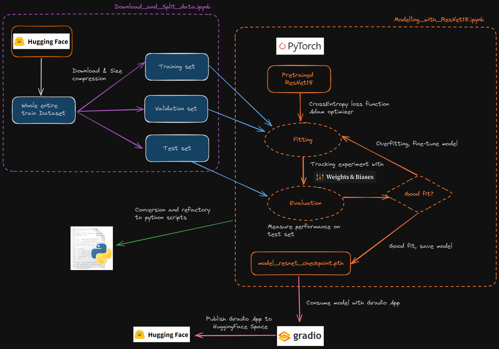

## Image Classification on Trash

This project is development is conducted with the purpose of demonstrating the entire lifecycle of deep learning with adherance to software development practices. Few steps such as automation with GitHub Action, model tracking and versioning with Weights and Biases are implemented to further promote smooth transitions and flexibility. In this case, deep learning to answer multiclass classification is chosen to properly recognize types of trashes with machine learning engineering practices.

### Problem Context

I came across the idea of making better use of pretrained Keras models that would see itself being able to learn and recognize variational patterns of animals under the same class, particularly class of bird. Acknowledging my liking of bird, I took a decision to put my machine learning engineering ability and knowledge into building project that would share meaningful purpose that machine learning could hope to achieve.

Our focus is set on utilizing a pretrained model ResNet18 to capture and recognize high-level features of six categories: cardboard, glass, metal, paper, plastic, and trash.

ResNet18 is chosen as a convolutional base and a new customised classification layer is placed on the top of this base. This layer is given a task to give output based on probability generated from the ResNet18 model. Confusion matrix is used for measuring quality.

### Dataset Image 

A collection of trash iamges are available for download from https://huggingface.co/datasets/garythung/trashnet. This set comes in a large dictionary packed with Pillow images at the large size, prompting us to  of modification and file organization so that PyTorch vision models could be able to update weights from images fed from input pipelines.

### Project Description

Sequences of executions begins from image preparation and initial image visualization, deep learning building, training, and assessing performance; these are covered in `Modelling.ipynb`. Trained models, resides in directory 'models/ResNet18', goes through conversion process in which its structures change from `assets`, `variables`, and `savedmodel.pb` to TFlite format and SavedModel suitable for sending prediction in respond to incoming requests across REST API or running docker images.


### Environment

A virtual environment `Pipenv` is employed for this project. 

Steps to activate pipenv and install required libraries:
```
pipenv install numpy pillow torch==2.3.0+cu118 torchvision==0.18.0+cu118
pipenv install -d pytest flake8 black

# Activate the virtual environment
pipenv shell

# To exit the virtual environment
exit
``` 

### Procedural Steps

1) Reorganizing and resizing images to filling in on the three folders prepared in the `data/processed/`.
2) Calling them from from `data/preprocessed`, we putting images and labels together in the form of `DataLoader`.
3) Utilizing ResNet18 with its pretrained weight to be attached with a new classification layer. A new purpose model in PyTorch is created.
4) Feeding training sets in batches to the residual network and evaluate its predicting capability on the validation set.
5) Throughout training process, the loss and accuracy per epoch are gathered by Weights & Biases, a prediction table is also included.
6) Testing ResNet18 on the test set, and measure how far the overfitting extends.
7) Saving the model, then use it to do some demonstration in Gradio app.
8) Publishing the Gradio app along with some files and a trained ResNet model to HuggingFace Hub.  

